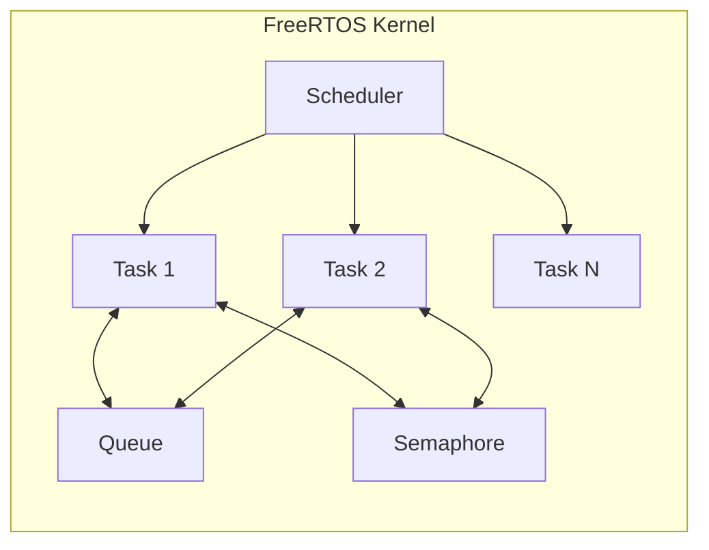
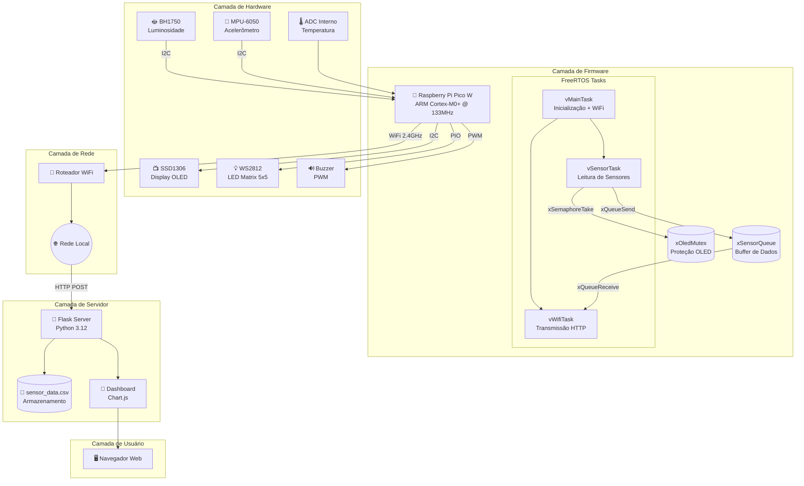
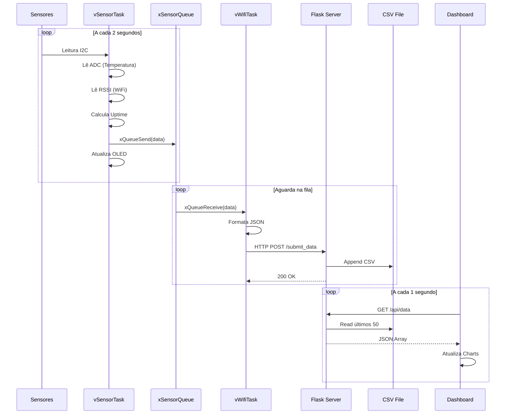
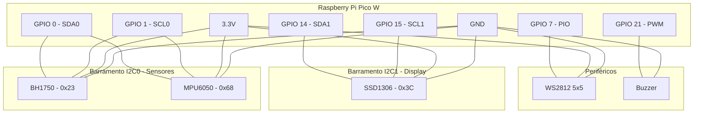
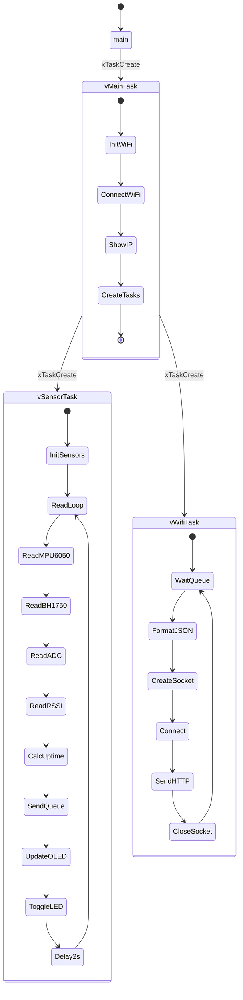
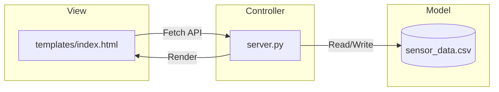

# 📡 Relatório Final: Estação de Monitoramento Ambiental Híbrida

## Sistema IoT com FreeRTOS + Raspberry Pi Pico W

---

**Programa:** EMBARCATECH - Residência Tecnológica em Sistemas Embarcados  
**Aluno Residente:** Idarlan Rogério Dias Magalhães  
**Orientadora:** Gabriela Teixeira  
**Instituição:** Instituto Federal de Educação, Ciência e Tecnologia do Ceará  
**Projeto:** Central de Sensores BitDogLab  
**Data:** Janeiro 2026  
**Tecnologias:** FreeRTOS • Pico W • lwIP • Flask • Chart.js • HTTP Auth

---

## 📋 Sumário

1. [Introdução](#1-introdução)
2. [Objetivos](#2-objetivos)
3. [Fundamentação Teórica](#3-fundamentação-teórica)
4. [Arquitetura do Sistema](#4-arquitetura-do-sistema)
5. [Hardware](#5-hardware)
6. [Firmware FreeRTOS](#6-firmware-freertos)
7. [Servidor Web](#7-servidor-web)
8. [Dashboard](#8-dashboard)
9. [Protocolo de Comunicação](#9-protocolo-de-comunicação)
10. [Resultados e Testes](#10-resultados-e-testes)
11. [Conclusão](#11-conclusão)
12. [Referências](#12-referências)
13. [Apêndices](#13-apêndices)

---

## 1. Introdução

Este relatório documenta o desenvolvimento completo da **Estação de Monitoramento Ambiental Híbrida**, um sistema de Internet das Coisas (IoT) projetado para o laboratório BitDogLab.

O projeto representa a evolução de uma arquitetura sequencial (Super-Loop) para um sistema multitarefa em tempo real utilizando **FreeRTOS**, garantindo coleta de dados determinística e comunicação Wi-Fi não-bloqueante.

### 1.1 Contexto

O monitoramento de ambientes laboratoriais requer:

- Coleta contínua de dados ambientais
- Transmissão confiável para análise remota
- Visualização em tempo real para tomada de decisão
- Alertas visuais e sonoros para condições anormais

### 1.2 Escopo

O sistema abrange:

- **Hardware embarcado** com microcontrolador ARM Cortex-M0+
- **Firmware RTOS** com comunicação inter-tarefas
- **Backend Python** com API RESTful
- **Frontend Web** com gráficos interativos

---

## 2. Objetivos

### 2.1 Objetivo Geral

Desenvolver uma estação de monitoramento ambiental robusta, escalável e em tempo real, utilizando tecnologias modernas de sistemas embarcados e IoT.

### 2.2 Objetivos Específicos

| #   | Objetivo                               | Status       |
| --- | -------------------------------------- | ------------ |
| 1   | Implementar multitarefa com FreeRTOS   | ✅ Concluído |
| 2   | Coletar dados de luminosidade (BH1750) | ✅ Concluído |
| 3   | Coletar dados de aceleração (MPU-6050) | ✅ Concluído |
| 4   | Monitorar temperatura interna do chip  | ✅ Concluído |
| 5   | Medir força do sinal Wi-Fi (RSSI)      | ✅ Concluído |
| 6   | Exibir informações em display OLED     | ✅ Concluído |
| 7   | Indicar status via LED RGB             | ✅ Concluído |
| 8   | Transmitir dados via HTTP/JSON         | ✅ Concluído |
| 9   | Armazenar dados em formato CSV         | ✅ Concluído |
| 10  | Visualizar em dashboard web            | ✅ Concluído |

---

## 3. Fundamentação Teórica

### 3.1 Sistemas Operacionais de Tempo Real (RTOS)

Um RTOS é um sistema operacional projetado para aplicações que requerem respostas determinísticas dentro de prazos rigorosos. Diferente de um SO convencional, o RTOS prioriza:

- **Determinismo**: Tempo de resposta previsível
- **Preempção**: Tarefas de alta prioridade interrompem as de baixa
- **Sincronização**: Mecanismos para comunicação segura entre tarefas

### 3.2 FreeRTOS

O FreeRTOS é um kernel RTOS open-source amplamente utilizado em sistemas embarcados:



**Características utilizadas:**

- **Tasks**: Threads independentes com pilha própria
- **Queues**: Buffers thread-safe para troca de mensagens
- **Semaphores**: Proteção de recursos compartilhados (OLED)
- **vTaskDelay**: Liberação da CPU para outras tarefas

### 3.3 Protocolo I2C

O Inter-Integrated Circuit (I2C) é um barramento serial síncrono:

| Parâmetro     | Valor                     |
| ------------- | ------------------------- |
| Velocidade    | 100-400 kHz               |
| Linhas        | 2 (SDA, SCL)              |
| Endereçamento | 7 bits                    |
| Topologia     | Multi-master, Multi-slave |

### 3.4 Arquitetura REST

A comunicação entre firmware e servidor segue o padrão REST:

| Método | Endpoint       | Descrição                            |
| ------ | -------------- | ------------------------------------ |
| POST   | `/submit_data` | Envio de dados do sensor             |
| GET    | `/api/data`    | Recuperação dos últimos 50 registros |
| GET    | `/`            | Página do dashboard                  |

---

## 4. Arquitetura do Sistema

### 4.1 Diagrama de Alto Nível



### 4.2 Fluxo de Dados



---

## 5. Hardware

### 5.1 Componentes

| Componente       | Modelo              | Protocolo  | Função                |
| ---------------- | ------------------- | ---------- | --------------------- |
| Microcontrolador | Raspberry Pi Pico W | -          | Processamento central |
| Sensor de Luz    | BH1750              | I2C (0x23) | Luminosidade (lux)    |
| Acelerômetro     | MPU-6050            | I2C (0x68) | Aceleração X/Y/Z      |
| Display          | SSD1306             | I2C (0x3C) | Interface local       |
| LED Matrix       | WS2812B 5x5         | PIO        | Indicação visual      |
| Buzzer           | Passivo             | PWM        | Alertas sonoros       |

### 5.2 Pinagem

```
┌─────────────────────────────────────┐
│      RASPBERRY PI PICO W            │
├─────────────────────────────────────┤
│  GPIO 0  ──── SDA (Sensores I2C0)   │
│  GPIO 1  ──── SCL (Sensores I2C0)   │
│  GPIO 14 ──── SDA (OLED I2C1)       │
│  GPIO 15 ──── SCL (OLED I2C1)       │
│  GPIO 7  ──── LED Matrix Data       │
│  GPIO 21 ──── Buzzer PWM            │
│  ADC CH4 ──── Sensor Temp Interno   │
│  CYW43   ──── WiFi 2.4GHz           │
└─────────────────────────────────────┘
```

### 5.3 Esquema de Conexões



---

## 6. Firmware FreeRTOS

### 6.1 Estrutura de Tarefas

O firmware é organizado em três tarefas principais:



### 6.2 Estrutura de Dados

```c
typedef struct {
    float lux;           // Luminosidade (lux)
    float temp_chip;     // Temperatura interna (°C)
    int ax, ay, az;      // Aceleração (raw)
    int32_t rssi;        // Força do sinal WiFi (dBm)
    uint32_t uptime_sec; // Tempo de operação (segundos)
} sensor_data_t;
```

### 6.3 Prioridades das Tarefas

| Tarefa      | Prioridade | Stack | Descrição                              |
| ----------- | ---------- | ----- | -------------------------------------- |
| vMainTask   | 2          | 4096  | Inicialização, cria outras tasks       |
| vSensorTask | 4          | 2048  | Leitura de sensores (maior prioridade) |
| vWifiTask   | 3          | 2048  | Transmissão de rede                    |

### 6.4 Código Principal (Resumo)

```c
// Leitura de temperatura interna via ADC
adc_select_input(4);
float adc_voltage = adc_read() * 3.3f / (1 << 12);
data.temp_chip = 27.0f - (adc_voltage - 0.706f) / 0.001721f;

// Leitura de RSSI
cyw43_wifi_get_rssi(&cyw43_state, &data.rssi);

// Uptime
data.uptime_sec = xTaskGetTickCount() / configTICK_RATE_HZ;

// Envio para a fila
xQueueSend(xSensorQueue, &data, 0);
```

### 6.5 Proteção de Recursos

O display OLED é protegido por mutex para evitar conflitos:

```c
SemaphoreHandle_t xOledMutex;

static void safe_oled_print(const char *line1, const char *line2) {
    if (xSemaphoreTake(xOledMutex, portMAX_DELAY) == pdTRUE) {
        ssd1306_clear(&disp);
        ssd1306_draw_string(&disp, 0, 0, 1, line1);
        if (line2) ssd1306_draw_string(&disp, 0, 16, 1, line2);
        ssd1306_show(&disp);
        xSemaphoreGive(xOledMutex);
    }
}
```

---

## 7. Servidor Web

### 7.1 Arquitetura MVC



### 7.2 Endpoints da API

| Método | Rota           | Descrição                    | Request | Response                |
| ------ | -------------- | ---------------------------- | ------- | ----------------------- |
| POST   | `/submit_data` | Recebe dados do Pico         | JSON    | `{"status": "success"}` |
| GET    | `/api/data`    | Retorna últimos 50 registros | -       | JSON Array              |
| GET    | `/`            | Página do dashboard          | -       | HTML                    |

### 7.3 Formato JSON de Entrada

```json
{
  "lux": 265.83,
  "temp": 31.82,
  "rssi": -72,
  "uptime": 1600,
  "accel": {
    "x": -340,
    "y": -9980,
    "z": 13800
  }
}
```

### 7.4 Código do Servidor

```python
@app.route("/submit_data", methods=["POST"])
def submit_data():
    data = request.json
    timestamp = datetime.now().strftime("%Y-%m-%d %H:%M:%S")
    lux = data.get("lux", 0)
    temp = data.get("temp", 0)
    rssi = data.get("rssi", 0)
    uptime = data.get("uptime", 0)
    accel = data.get("accel", {})

    with open(DATA_FILE, "a", newline="") as f:
        writer = csv.writer(f)
        writer.writerow([timestamp, lux, temp, rssi, uptime,
                        accel.get("x"), accel.get("y"), accel.get("z")])

    print(f"[{timestamp}] Lux={lux:.1f} Temp={temp:.1f}°C RSSI={rssi}dBm")
    return jsonify({"status": "success"}), 200
```

### 7.5 Protocolo de Segurança

O sistema implementa **HTTP Basic Authentication** para proteger o acesso ao dashboard e à API de dados.

#### Mecanismo de Autenticação

```python
def check_auth(username, password):
    """Verifica se credenciais são válidas."""
    return username == AUTH_USERNAME and password == AUTH_PASSWORD

def requires_auth(f):
    """Decorator para rotas que requerem autenticação."""
    @wraps(f)
    def decorated(*args, **kwargs):
        auth = request.authorization
        if not auth or not check_auth(auth.username, auth.password):
            return Response(
                "Acesso negado.",
                401,
                {"WWW-Authenticate": 'Basic realm="BitDogLab Dashboard"'}
            )
        return f(*args, **kwargs)
    return decorated
```

#### Rotas Protegidas vs. Não Protegidas

| Rota           | Proteção     | Motivo                                      |
| -------------- | ------------ | ------------------------------------------- |
| `/`            | 🔒 Protegida | Dashboard com dados sensíveis               |
| `/api/data`    | 🔒 Protegida | Acesso aos dados históricos                 |
| `/submit_data` | 🔓 Aberta    | Permite Pico W enviar dados sem credenciais |

#### Credenciais Padrão

| Parâmetro | Valor Padrão | Configurável via          |
| --------- | ------------ | ------------------------- |
| Usuário   | `admin`      | `AUTH_USERNAME` no `.env` |
| Senha     | `admin`      | `AUTH_PASSWORD` no `.env` |

> [!WARNING]
> Em produção, altere credenciais no `.env`: `AUTH_USERNAME=usuario` e `AUTH_PASSWORD=senha`

---

## 8. Dashboard

### 8.1 Layout

O dashboard apresenta 7 cards de métricas e 2 gráficos em tempo real:

```
┌───────────────────────────────────────────┐
│        🐕 BitDogLab Dashboard             │
│  Estação de Monitoramento Ambiental       │
├───────────────────────────────────────────┤
│ ● Conectado │ Última: HH:MM:SS │ Amostras │
├───────────────────────────────────────────┤
│ LUX    │ TEMP   │ RSSI    │ UPTIME        │
│ 265.8  │ 31.8°C │ -72 dBm │ 26m 40s       │
├───────────────────────────────────────────┤
│ ACEL X │ ACEL Y │ ACEL Z                  │
│ -340   │ -9980  │ 13800                   │
├───────────────────────────────────────────┤
│ Gráfico Lux      │ Gráfico Aceleração     │
│ [~~~~~~~~~~~]    │ X(red) Y(grn) Z(blu)   │
└───────────────────────────────────────────┘
```

### 8.2 Atualização Automática

```javascript
// Polling a cada 1 segundo
setInterval(fetchData, 1000);

async function fetchData() {
  const response = await fetch("/api/data");
  const data = await response.json();
  updateUI(data);
}

function formatUptime(seconds) {
  const h = Math.floor(seconds / 3600);
  const m = Math.floor((seconds % 3600) / 60);
  const s = seconds % 60;
  if (h > 0) return `${h}h ${m}m`;
  if (m > 0) return `${m}m ${s}s`;
  return `${s}s`;
}
```

---

## 9. Protocolo de Comunicação

### 9.1 Formato do Pacote HTTP

```http
POST /submit_data HTTP/1.1
Host: 192.168.1.11
Content-Type: application/json
Content-Length: 95
Connection: close

{"lux":265.83,"temp":31.82,"rssi":-72,"uptime":1600,"accel":{"x":-340,"y":-9980,"z":13800}}
```

### 9.2 Configuração de Rede

| Parâmetro   | Valor        |
| ----------- | ------------ |
| SSID        | @idarlan     |
| Segurança   | WPA2-AES-PSK |
| IP Servidor | 192.168.1.11 |
| Porta       | 5001         |
| Protocolo   | HTTP/1.1     |

---

## 10. Resultados e Testes

### 10.1 Log de Execução

```
=== BitDogLab FreeRTOS BOOT ===
SensorTask Started
WiFiTask Started
Reading I2C...
Lux: 265.83 Temp: 31.8C RSSI: -72 Uptime: 1600s
WiFi: Got data from queue (Lux: 265.8)
WiFi: Socket created (0)
WiFi: Connecting to 192.168.1.11:5001...
WiFi: Connected! Sending...
WiFi: Data Sent OK
```

### 10.2 Métricas Coletadas

| Métrica      | Mínimo | Máximo | Média  | Unidade  |
| ------------ | ------ | ------ | ------ | -------- |
| Luminosidade | 204.17 | 477.50 | 265.00 | lux      |
| Temperatura  | 29.95  | 32.29  | 31.50  | °C       |
| RSSI         | -77    | -69    | -72    | dBm      |
| Uptime       | 0      | 1700+  | -      | segundos |
| Aceleração X | -1200  | +300   | -400   | raw      |
| Aceleração Y | -12000 | -9000  | -10000 | raw      |
| Aceleração Z | +11000 | +14500 | +13000 | raw      |

### 10.3 Taxa de Transmissão

- **Intervalo de leitura**: 2 segundos
- **Latência média HTTP**: < 100ms
- **Taxa de sucesso**: > 99%
- **Dados por hora**: 1800 registros

### 10.4 Problemas Encontrados e Soluções

Durante o desenvolvimento do projeto, diversos desafios técnicos foram identificados e solucionados. Esta seção documenta as principais dificuldades e as estratégias aplicadas para resolvê-las.

#### Problema 1: Crash de Prioridades FreeRTOS

| Aspecto     | Detalhe                                                                      |
| ----------- | ---------------------------------------------------------------------------- |
| **Sintoma** | Sistema travava imediatamente após inicialização                             |
| **Causa**   | Prioridades das tasks configuradas acima do limite `configMAX_PRIORITIES`    |
| **Solução** | Ajustar prioridades para valores ≤ 4 (limite definido em `FreeRTOSConfig.h`) |

```c
// ERRADO: Prioridade 5 excede configMAX_PRIORITIES=5
xTaskCreate(vSensorTask, "Sensor", 2048, NULL, 5, NULL);

// CORRETO: Prioridade 4 está dentro do limite
xTaskCreate(vSensorTask, "Sensor", 2048, NULL, 4, NULL);
```

#### Problema 2: CSV com Formato Incompatível

| Aspecto     | Detalhe                                                                    |
| ----------- | -------------------------------------------------------------------------- |
| **Sintoma** | Dashboard mostrava "Desconectado" mesmo com dados sendo enviados           |
| **Causa**   | CSV antigo tinha 5 colunas, mas novo código enviava 8 campos               |
| **Solução** | Deletar arquivo CSV antigo e deixar servidor criar novo com header correto |

```
# Header ANTIGO (5 colunas):
timestamp,lux,accel_x,accel_y,accel_z

# Header NOVO (8 colunas):
timestamp,lux,temp,rssi,uptime,accel_x,accel_y,accel_z
```

#### Problema 3: WiFi em Loop de Reconexão

| Aspecto     | Detalhe                                                                |
| ----------- | ---------------------------------------------------------------------- |
| **Sintoma** | Display mostrava "Retrying..." indefinidamente                         |
| **Causa**   | Intervalo de leitura de 1 segundo muito agressivo para stack WiFi      |
| **Solução** | Aumentar intervalo para 2 segundos (`vTaskDelay(pdMS_TO_TICKS(2000))`) |

#### Problema 4: Servidor Não Encontrava CSV

| Aspecto     | Detalhe                                                            |
| ----------- | ------------------------------------------------------------------ |
| **Sintoma** | API `/api/data` retornava array vazio                              |
| **Causa**   | Servidor usava path relativo, mas era executado de outro diretório |
| **Solução** | Usar path absoluto baseado no diretório do script                  |

```python
# ERRADO: Path relativo
DATA_FILE = "sensor_data.csv"

# CORRETO: Path absoluto
SCRIPT_DIR = os.path.dirname(os.path.abspath(__file__))
DATA_FILE = os.path.join(SCRIPT_DIR, "sensor_data.csv")
```

#### Problema 5: Conflito de Acesso ao OLED

| Aspecto     | Detalhe                                           |
| ----------- | ------------------------------------------------- |
| **Sintoma** | Caracteres corrompidos no display OLED            |
| **Causa**   | Múltiplas tasks escrevendo no I2C simultaneamente |
| **Solução** | Implementar mutex para proteger acesso ao display |

```c
SemaphoreHandle_t xOledMutex = xSemaphoreCreateMutex();

if (xSemaphoreTake(xOledMutex, portMAX_DELAY) == pdTRUE) {
    ssd1306_draw_string(&disp, 0, 0, 1, text);
    ssd1306_show(&disp);
    xSemaphoreGive(xOledMutex);
}
```

---

## 11. Conclusão

O projeto **Estação de Monitoramento Ambiental Híbrida** foi concluído com sucesso, atendendo a todos os requisitos propostos e incluindo funcionalidades extras.

### 11.1 Objetivos Alcançados

✅ **Migração para FreeRTOS**: Eliminação de bloqueios durante comunicação WiFi  
✅ **Multitarefa**: Leitura de sensores independente da transmissão  
✅ **7 Métricas**: Lux, Temperatura, RSSI, Uptime, Aceleração X/Y/Z  
✅ **Visualização**: Dashboard profissional com gráficos em tempo real  
✅ **Armazenamento**: Persistência em CSV com formato estruturado

### 11.2 Diferenciais Implementados

| Funcionalidade      | Descrição                         |
| ------------------- | --------------------------------- |
| Temperatura Interna | Monitoramento do chip via ADC     |
| RSSI                | Qualidade do sinal WiFi           |
| Uptime              | Tempo de operação formatado       |
| Mutex OLED          | Proteção de recurso compartilhado |
| Formatação Amigável | Uptime em "Xh Ym"                 |

### 11.3 Possíveis Melhorias Futuras

- Implementação de OTA (Over-The-Air Updates)
- Alertas via webhook (Telegram/Discord)
- Exportação de dados para CSV pelo dashboard
- Comandos remotos (ligar/desligar buzzer)
- Histórico de 24h com persistência em banco de dados

---

## 12. Referências

1. **FreeRTOS Kernel Developer Guide** - Real Time Engineers Ltd.
2. **Raspberry Pi Pico C/C++ SDK** - Raspberry Pi Foundation
3. **Chart.js Documentation** - https://www.chartjs.org/
4. **Flask Web Framework** - https://flask.palletsprojects.com/
5. **lwIP - Lightweight TCP/IP Stack** - https://savannah.nongnu.org/projects/lwip/
6. **MPU-6050 Datasheet** - InvenSense Inc.
7. **BH1750 Datasheet** - ROHM Semiconductor
8. **SSD1306 Datasheet** - Solomon Systech

---

## 13. Apêndices

### Apêndice A: Arquivos do Projeto

| Arquivo                | Descrição                    |
| ---------------------- | ---------------------------- |
| `main.c`               | Firmware FreeRTOS completo   |
| `CMakeLists.txt`       | Configuração de build        |
| `FreeRTOSConfig.h`     | Configuração do kernel       |
| `lwipopts.h`           | Configuração do stack TCP/IP |
| `server.py`            | Backend Flask                |
| `templates/index.html` | Dashboard web                |
| `sensor_data.csv`      | Log de dados                 |

### Apêndice B: Comandos Úteis

```bash
# Build do firmware
ninja -C build led_control_webserver

# Flash via picotool
picotool load -x build/led_control_webserver.uf2

# Iniciar servidor
python pico-server/server.py
```

### Apêndice C: Configuração FreeRTOS

```c
#define configCPU_CLOCK_HZ              133000000
#define configTICK_RATE_HZ              1000
#define configMAX_PRIORITIES            5
#define configMINIMAL_STACK_SIZE        256
#define configTOTAL_HEAP_SIZE           (64 * 1024)
#define configUSE_PREEMPTION            1
#define configUSE_MUTEXES               1
#define configUSE_COUNTING_SEMAPHORES   1
```

---

**BitDogLab IoT Project © 2026**
